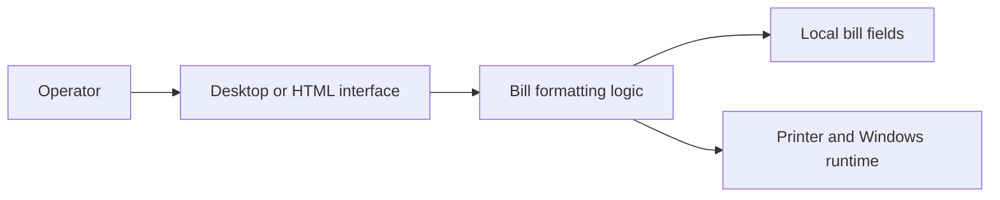
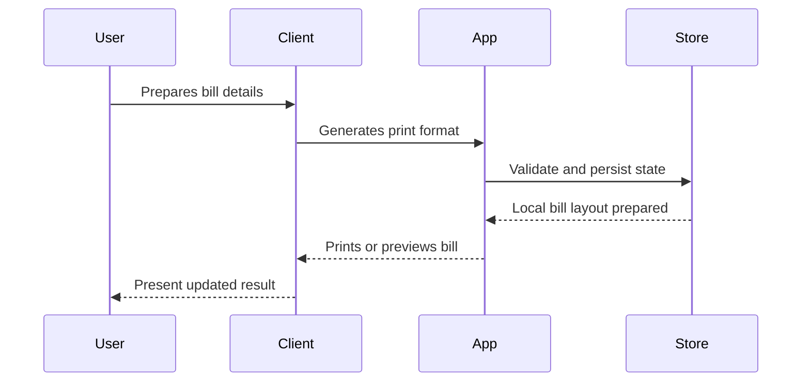

# Architecture

The project centers on a printable HTML format and local source workflow, with a packaged Windows artifact for easier operation.

## Component View

## Key Components

- Printable HTML template
- Source code folder
- Dependency requirements
- Packaged Windows output

## Main Workflow

## Design Considerations

- Prioritize predictable layout
- Keep business-specific fields configurable
- Treat packaged output as a release artifact

